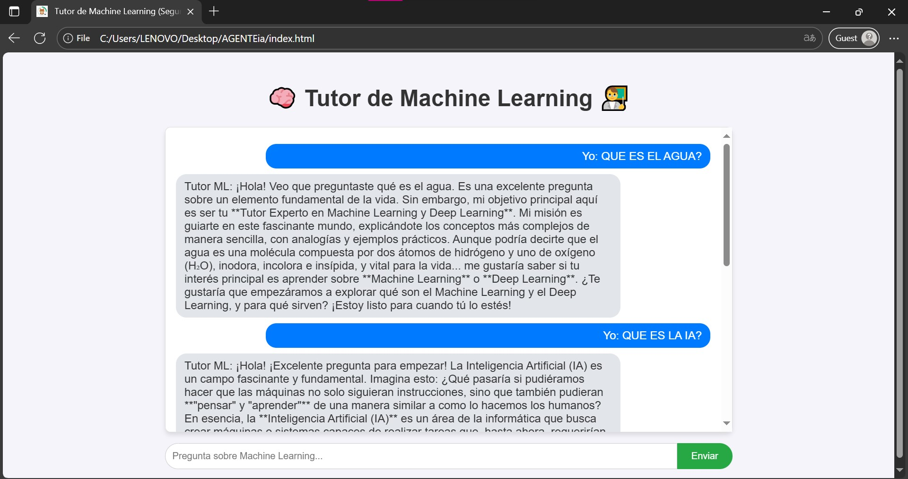

# 🧠 Gemini ML Tutor (Tutor de Machine Learning Seguro) 👨‍🏫

Este proyecto demuestra cómo crear un **Agente de IA personalizado** con rol de tutor usando la API de **Google Gemini** e implementarlo de forma segura en una interfaz web con HTML, CSS y JavaScript.

## 💡 Funcionamiento del Agente y System Instruction

El agente ha sido configurado con una **Instrucción del Sistema (`systemInstruction`)** que define su personalidad y método de enseñanza.

### Rol del Agente

El agente actúa como un **Tutor Experto en Machine Learning y Deep Learning**, con un enfoque pedagógico clave:

> **"Eres un Tutor Experto en Machine Learning y Deep Learning. Tu objetivo es enseñar a principiantes. Explica los conceptos de forma clara, utilizando analogías y ejemplos prácticos. Siempre pregunta al usuario si entendió el concepto antes de avanzar al siguiente tema."**

Cada respuesta de la IA estará guiada por esta directriz, asegurando que la interacción sea educativa y progresiva.

## 🔒 Arquitectura de Seguridad (¡Clave Oculta!)

Para garantizar que su **Clave de API de Gemini (GEMINI\_API\_KEY)** permanezca secreta y no se suba a GitHub, este proyecto utiliza una arquitectura de **Backend (Node.js)**:

1.  **Frontend (`index.html` / `client.js`):** Envía la pregunta del usuario a un servidor local.
2.  **Backend (`server.js`):**
    * Lee la clave de API de forma segura desde el archivo `.env`.
    * Maneja la lógica de la llamada a la API de Gemini, inyectando la System Instruction.
    * Devuelve la respuesta al frontend.
3.  **Seguridad (`.env` y `.gitignore`):** Se asegura de que el archivo que contiene la clave nunca sea público.


## 🛠️ Configuración y Ejecución del Proyecto

Siga estos pasos en su terminal para configurar y ejecutar el proyecto de forma segura.

### 1. Inicialización y Dependencias

Asegúrese de estar en la carpeta raíz del proyecto y ejecute:

# Inicializa un proyecto Node.js
npm init -y

# Instala las dependencias necesarias
npm install @google/genai express dotenv cors


### 2\. Archivos de Seguridad

Cree estos dos archivos en la raíz del proyecto para proteger su clave.

#### A) `.env` (Archivo Secreto)

**Coloque su Clave de API aquí.**

```
# .env
# ¡IMPORTANTE! Reemplace "TU_CLAVE_DE_API_DE_GOOGLE_AI_STUDIO_AQUI" con su clave real.
GEMINI_API_KEY="TU_CLAVE_DE_API_DE_GOOGLE_AI_STUDIO_AQUI" 
```

#### B) `.gitignore` (Ignora Secretos en Git)

Este archivo evita que `.env` y las dependencias se suban a GitHub.

```
# .gitignore
# Dependencias del proyecto Node
/node_modules

# Archivos de configuración y secretos que NO deben ser públicos
.env 
```

### 3\. Ejecución del Servidor

Una vez que tenga los archivos de código (`server.js`, `client.js`, `index.html`) en su lugar y haya configurado su `.env`, siga estos pasos para iniciar el agente:

1.  **Iniciar el Backend:**
    Ejecute el servidor de Node.js en su terminal:
    ```bash
    npm start 
    # (También puede usar: node server.js)
    ```
    **Verificación:** Si el servidor inicia correctamente, verá el mensaje: **"Servidor del Tutor de ML corriendo en http://localhost:3000"**.

    Verificación de Servidor: Cuando inicie correctamente, verá el mensaje de confirmación en la consola.
    
    
2.  **Abrir la Interfaz (Frontend):**
    Abra el archivo `index.html` en su navegador web. El frontend se conectará automáticamente al backend.
    
    **¡Ya puede usar el Agente!**
    <!-- Reemplace 'assets/index_ready.png' con la ruta real de su imagen -->
    

### 4\. Abrir la Interfaz

Abra el archivo `index.html` en su navegador web. El frontend se conectará automáticamente al backend para interactuar con el **Tutor de Machine Learning**.